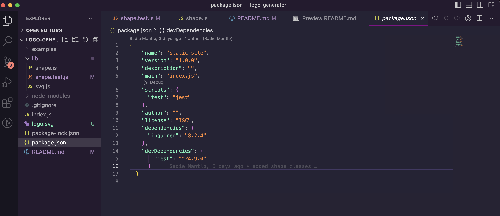

# Logo Generator 
## **Description**

This application is a logo generator that uses user input to create a svg file of a logo.

## **Installation**

This application uses inquirer to generate the questions that are asked and jest to test the application. To intall what is needed for this application, run "npm i inquirer@8.2.4" in the terminal.

## **Usage**

To use this application, run "node index.js" in the terminal and a series of questions will pop up. Your answers to the questions will then be used to populate your SVG file, which will be automatically generated after all the questions are answered. To watch a video on how to use this application, click [here](https://drive.google.com/file/d/1dFR5vbCrILCtoa-4hGJFtP0wZmVHzH7G/view). The sample SVG that was generated in the video is [here](./logo.svg).

Here is an image of what the JSON package should look like: 